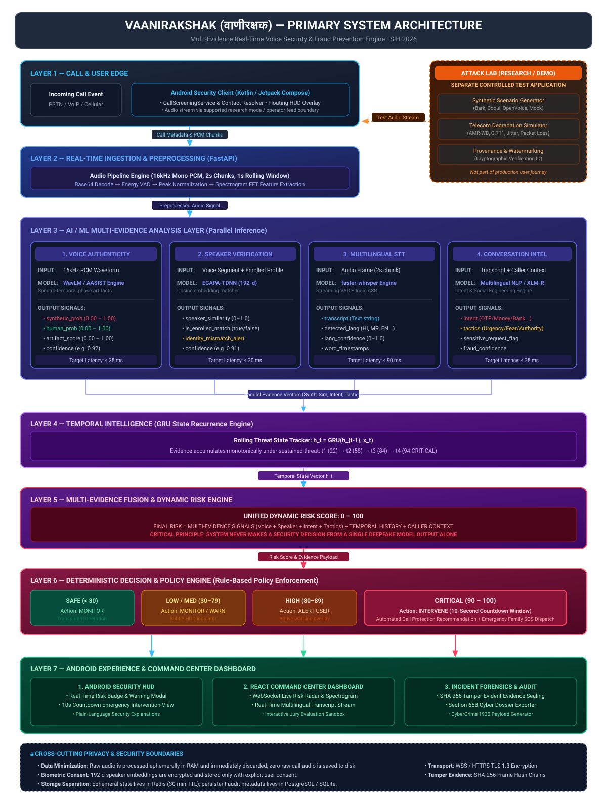

# Primary Judge Architecture — VaaniRakshak (वाणीरक्षक)

## 📌 Executive Overview for SIH Judges

**VaaniRakshak** is a real-time, multilingual AI-powered call security system engineered to defend citizens against AI voice cloning, deepfake impersonation, and social engineering fraud over phone calls.

> [!IMPORTANT]
> **Fundamental Design Principle**: VaaniRakshak **NEVER** makes a security decision from a single voice-deepfake detection model alone.
> Instead, it fuses **4 heterogeneous evidence vectors** over time using a rolling **Gated Recurrent Unit (GRU)** temporal risk engine, applying deterministic security policies to trigger user warnings, interactive 10-second emergency intervention countdowns, and automated family safety dispatch.

---

## 🏗️ Master Architecture Diagram



---

## 🔍 System Workflow Breakdown

```
CALL ARRIVES
      ↓
CALL / USER CONTEXT
      ↓
REAL-TIME INGESTION
      ↓
AUDIO PREPROCESSING
      ↓
MULTIPLE AI/ML ANALYSIS ENGINES
      ↓
VOICE AUTHENTICITY → SPEAKER VERIFICATION → SPEECH-TO-TEXT → CONVERSATION INTELLIGENCE
      ↓
SOCIAL ENGINEERING & FRAUD INTENT DETECTION
      ↓
TEMPORAL INTELLIGENCE (GRU STATE TRACKING)
      ↓
MULTI-EVIDENCE FUSION & DYNAMIC RISK SCORING (0 – 100)
      ↓
DETERMINISTIC DECISION ENGINE (POLICY & RISK BANDS)
      ↓
WARNING / INTERVENTION / EMERGENCY SOS
      ↓
ANDROID HUD & REACT COMMAND CENTER DASHBOARD
      ↓
SHA-256 INCIDENT FORENSICS & AUDIT DOSSIER
```

---

## 🔀 System Boundaries & Critical Architecture Reality

### 1. Attack Lab Separation Boundary
- **Attack Lab is NOT part of the production VaaniRakshak product or user journey.**
- It is a separate controlled research and adversarial testing application used to evaluate defense robustness by generating synthetic voice samples (Bark, Coqui, OpenVoice) and applying telecom network impairments (AMR-WB compression, packet loss, jitter).
- In the architecture diagram, Attack Lab is visually isolated inside a **dashed boundary** indicating its role as a test harness that feeds simulated audio into VaaniRakshak's ingestion interface.

### 2. Android Edge Reality
- Standard Android permissions (`CallScreeningService`, `RoleManager`, `ContactsContract`) manage call metadata, caller verification, contact resolution, and system overlays.
- Standard Android applications cannot directly intercept raw cellular call audio due to operating system security restrictions.
- Live audio processing in VaaniRakshak is supported via:
  1. **Research/Demo Mode**: Microphone loopback or WebSocket injection.
  2. **Future Telecom Carrier Tap**: Direct gRPC IMS/VoLTE core operator feeds.

### 3. Policy & Decision Engine (Deterministic vs LLM)
- Dynamic risk scores ($0 - 100$) are mapped to security actions by a **deterministic, rule-based policy engine**.
- Large Language Models (LLMs) or NLP models provide contextual summaries and fraud intent classifications, but **NEVER** directly execute call termination or intervention actions.

---

## 📁 Related Architecture Specifications

- [02 AI/ML Pipeline](02_ai_ml_pipeline.md)
- [03 Runtime Sequence](03_runtime_sequence.md)
- [04 Deployment Architecture](04_deployment_architecture.md)
- [05 Privacy & Security Architecture](05_privacy_security_architecture.md)
- [06 Attack Lab Boundary Specification](06_attack_lab_boundary.md)
