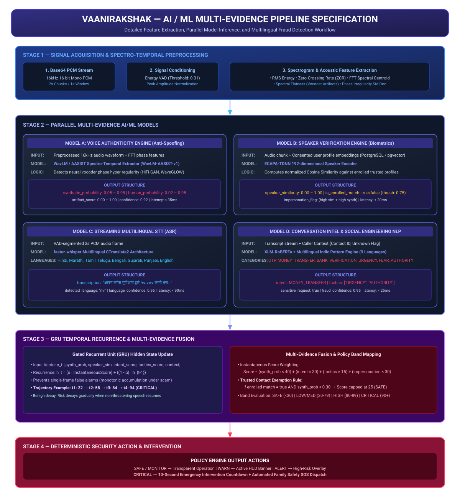

# AI / ML Multi-Evidence Pipeline — VaaniRakshak

## 📌 Overview

The **VaaniRakshak AI/ML Pipeline** processes incoming call audio streams through four parallel, specialized evidence engines operating within strict **< 200ms per-frame latency constraints**. The outputs of these models are fused into a rolling **Gated Recurrent Unit (GRU)** temporal state engine to track threat progression across time steps.

---

## 🏗️ AI/ML Pipeline Architecture

---

## 🤖 Detailed Engine Specifications

### 1. Voice Authenticity Engine (`WavLM-AASIST-v1`)
- **Primary Function**: Acoustic anti-spoofing and synthetic voice detection.
- **Architecture**: WavLM / AASIST spectro-temporal feature extractor.
- **Input**: 16kHz PCM audio chunk (Base64 decoded).
- **Extracted Features**: RMS Energy, Zero-Crossing Rate (ZCR), FFT Spectral Centroid, Spectral Flatness, Phase Irregularity Standard Deviation.
- **Target Output**:
  - `synthetic_probability`: Float $[0.00, 1.00]$
  - `human_probability`: Float $[0.00, 1.00]$
  - `artifact_score`: Float $[0.00, 1.00]$
  - `confidence`: Float (e.g., $0.92$)
- **Measured Latency**: **~ 35 ms**

### 2. Speaker Verification Engine (`ECAPA-TDNN-v1`)
- **Primary Function**: Consented biometric speaker verification and impersonation detection.
- **Architecture**: 192-dimensional ECAPA-TDNN speaker encoder.
- **Input**: PCM audio chunk + Consented enrolled trusted profile embeddings stored in PostgreSQL (`pgvector`).
- **Processing**: Computes normalized Cosine Similarity:
  $$\text{Similarity}(v_1, v_2) = \frac{v_1 \cdot v_2}{\|v_1\| \|v_2\|}$$
- **Target Output**:
  - `speaker_similarity`: Float $[0.00, 1.00]$
  - `is_enrolled_match`: Boolean (Threshold: $\ge 0.75$)
  - `identity_mismatch_alert`: Triggered when caller claims trusted identity but biometrics fail.
- **Measured Latency**: **~ 20 ms**

### 3. Multilingual Speech-to-Text Engine (`faster-whisper-multilingual`)
- **Primary Function**: Real-time ASR and spoken language identification.
- **Architecture**: `faster-whisper` (CTranslate2 implementation of OpenAI Whisper).
- **Input**: 2-second VAD-segmented PCM audio frame.
- **Supported Languages**: Hindi (`hi`), Marathi (`mr`), Tamil (`ta`), Telugu (`te`), Bengali (`bn`), Gujarati (`gu`), Punjabi (`pa`), English (`en`), and 8 extended Indic dialects.
- **Target Output**:
  - `transcription`: Spoken text string
  - `detected_language`: Language code (e.g. `hi`, `mr`)
  - `language_confidence`: Float $[0.00, 1.00]$
- **Measured Latency**: **~ 90 ms**

### 4. Conversation Intelligence & Social Engineering NLP
- **Primary Function**: Multilingual intent recognition and psychological manipulation tactic detection.
- **Architecture**: `XLM-RoBERTa` fine-tuned model + Deterministic Multilingual Regex Rules across 9 languages.
- **Supported Intent Categories**:
  - `MONEY_TRANSFER` (UPI, GPay, PhonePe, Paytm, Bank Transfer)
  - `OTP_REQUEST` (One Time Password, Verification Code harvesting)
  - `PASSWORD_REQUEST` / `PIN_REQUEST`
  - `REMOTE_ACCESS` (AnyDesk, TeamViewer, QuickSupport)
  - `APK_INSTALLATION` (Malicious APK link sharing)
  - `BANK_VERIFICATION` (KYC update, Account block coercion)
  - `EMERGENCY` / `THREAT` (Accident, Police arrest, CBI digital arrest)
- **Supported Social Engineering Tactics**:
  - `URGENCY`, `FEAR`, `AUTHORITY`, `SECRECY`, `PRESSURE`, `ISOLATION`
- **Target Output**:
  - `intent`: Intent enum string
  - `detected_tactics`: Array of tactic strings
  - `sensitive_request`: Boolean flag
- **Measured Latency**: **~ 25 ms**

---

## 📈 Temporal Risk Aggregation (GRU Engine)

Rather than evaluating each audio chunk in total isolation, VaaniRakshak maintains a rolling **8-dimensional hidden state vector** $h_t$:

$$h_t = \text{GRU}(h_{t-1}, x_t)$$

where $x_t = [\text{synthetic\_prob}, \text{speaker\_sim}, \text{intent\_score}, \text{tactics\_score}, \text{is\_unknown\_caller}]$.

- **Monotonic Threat Accumulation**: Under sustained fraud conditions (synthetic voice + OTP request + urgency tactic), risk increases reliably ($22 \rightarrow 58 \rightarrow 84 \rightarrow 94$) to reach `CRITICAL` state.
- **Benign Speech Decay**: Transient acoustic glitches or isolated words decay exponentially, preventing false positive call interventions.

---

## 📁 Related Architecture Specifications

- [01 Primary Judge Architecture](01_judge_architecture.md)
- [03 Runtime Sequence](03_runtime_sequence.md)
- [04 Deployment Architecture](04_deployment_architecture.md)
- [05 Privacy & Security Architecture](05_privacy_security_architecture.md)
- [06 Attack Lab Boundary Specification](06_attack_lab_boundary.md)
