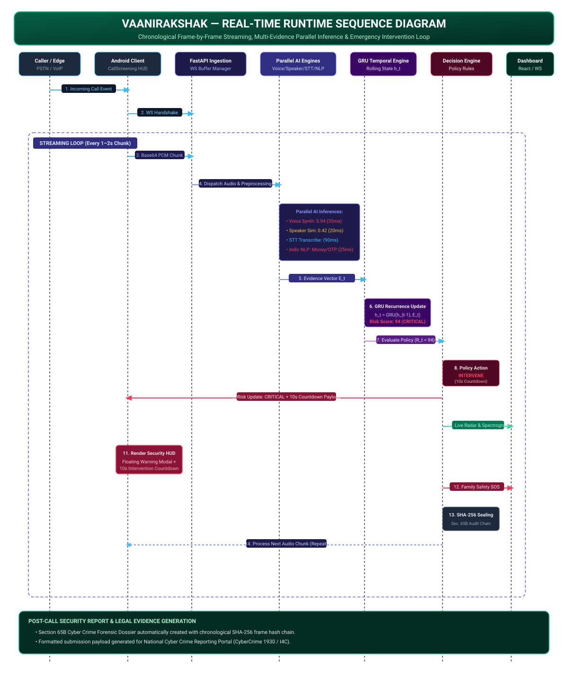

# Real-Time Runtime Sequence Specification — VaaniRakshak

## 📌 Overview

This document specifies the exact frame-by-frame execution sequence of **VaaniRakshak** during a live phone call session, illustrating how audio chunks move from the Android Security Client to the FastAPI AI backend, undergo parallel inference, update the GRU temporal risk state, and trigger progressive security interventions.

---

## 🏗️ Sequence Diagram

---

## 🔄 Sequence Walkthrough

1. **Call Initiation & Handshake**:
   - Incoming call is intercepted by Android `CallScreeningService`.
   - Android client resolves local contact policy (`ContactsContract`).
   - A persistent WebSocket connection is opened to `/ws/call/{session_id}`.

2. **Audio Streaming Loop (1–2s Chunks)**:
   - 16kHz PCM mono audio chunks (Base64 encoded) are continuously streamed over WebSocket.
   - FastAPI Ingestion buffer decodes audio, checks Energy VAD, applies peak normalization, and computes FFT spectro-temporal features.

3. **Parallel Multi-Evidence Inference**:
   - **Voice Authenticity**: Evaluates spectro-temporal phase artifacts ($\le 35\text{ms}$).
   - **Speaker Verification**: Extracts 192-d ECAPA-TDNN embedding and computes Cosine Similarity ($\le 20\text{ms}$).
   - **Multilingual STT**: Transcribes 2s audio frame via `faster-whisper` ($\le 90\text{ms}$).
   - **Conversation Intelligence**: Classifies intent and psychological tactics across 9 Indic languages ($\le 25\text{ms}$).

4. **Temporal Risk & Policy Evaluation**:
   - Evidence vector $E_t$ is pushed to the GRU Temporal Risk Engine.
   - Hidden state vector $h_t$ updates smoothly ($22 \rightarrow 58 \rightarrow 84 \rightarrow 94$).
   - Dynamic Risk Score $R_t = 94$ maps to policy band `CRITICAL`.

5. **Security Action & Emergency Interventions**:
   - Android Client receives WebSocket `risk_update` payload and displays floating warning overlay + **10-second Emergency Intervention Countdown View**.
   - React Command Center Dashboard updates live risk radar, spectrogram gauge, and transcript stream.
   - If risk remains critical, Emergency SOS dispatcher broadcasts dual-language SMS/WhatsApp safety alerts to enrolled family contacts.
   - Evidence frame is sealed into SHA-256 hash chain.

6. **Post-Call Legal Dossier Generation**:
   - Session teardown triggers Section 65B forensic dossier export and National Cyber Crime Reporting Portal (1930 / I4C) payload generation.

---

## 📁 Related Architecture Specifications

- [01 Primary Judge Architecture](01_judge_architecture.md)
- [02 AI/ML Pipeline](02_ai_ml_pipeline.md)
- [04 Deployment Architecture](04_deployment_architecture.md)
- [05 Privacy & Security Architecture](05_privacy_security_architecture.md)
- [06 Attack Lab Boundary Specification](06_attack_lab_boundary.md)
