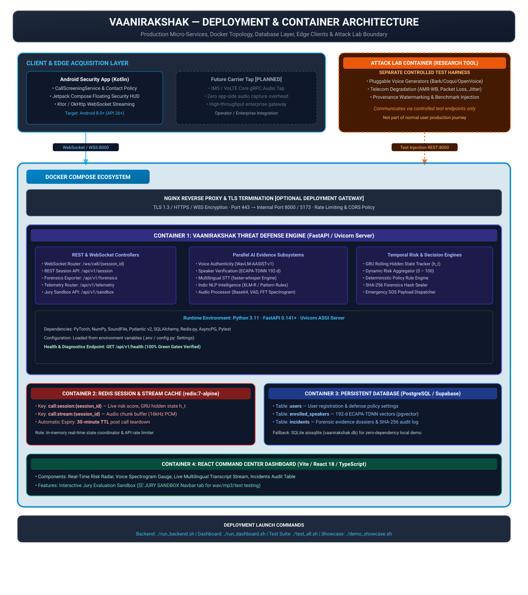

# Deployment & Container Architecture — VaaniRakshak

## 📌 Overview

**VaaniRakshak** is architected for containerized deployment using Docker Compose, providing a production-hardened micro-services topology. The backend services run inside Python 3.11 FastAPI containers paired with Redis for low-latency session caching and PostgreSQL (with `pgvector`) or SQLite for persistent forensic audit logging.

---

## 🏗️ Deployment Topology Diagram



---

## 📦 Container Services Breakdown

| Container / Subsystem | Technology Stack | Port / Protocol | Primary Responsibility |
| :--- | :--- | :--- | :--- |
| **Android Security Client** | Kotlin 1.9+, Jetpack Compose, Ktor Client | Client Edge | Intercepts call metadata, displays floating HUD overlay, streams PCM audio over WSS. |
| **FastAPI Defense Engine** | Python 3.11, FastAPI, Uvicorn, PyTorch, Pytest | `8000` (HTTP / WSS) | Main threat defense engine hosting parallel AI models, GRU temporal aggregator, and policy rules. |
| **Redis Session Cache** | `redis:7-alpine` | `6379` (TCP) | Low-latency session state tracker ($h_t$), audio chunk stream buffer, 30-min TTL expiry. |
| **PostgreSQL / Supabase DB** | PostgreSQL 16 + `pgvector` (or SQLite `vaanirakshak.db`) | `5432` (TCP) | Persistent store for user policies, 192-d ECAPA-TDNN enrolled speaker profiles, and forensic logs. |
| **React Command Center** | React 18, Vite, TypeScript, Tailwind CSS | `5173` (HTTP) | Web surveillance dashboard with risk radar, spectrogram gauge, transcript stream, and Jury Sandbox. |
| **Attack Lab Container** | Python 3.11, Bark, Coqui, OpenVoice | Separate Test Harness | Controlled test generator and telecom degradation simulator (Not part of user production path). |

---

## 🚀 One-Command Launch Quickstart

### Run Backend Engine
```bash
./run_backend.sh
```
Starts Uvicorn ASGI server on `http://localhost:8000`.

### Run Command Center Dashboard
```bash
./run_dashboard.sh
```
Launches Vite development server on `http://localhost:5173`.

### Run Automated Test Suite Verification
```bash
./test_all.sh
```
Executes all automated backend test suites and verifies the dashboard build gates.

### Run SIH Jury Evaluation Showcase
```bash
./demo_showcase.sh
```
Executes all 3 mandatory SIH scenarios sequentially with live terminal telemetry and forensic audit generation.

---

## 📁 Related Architecture Specifications

- [01 Primary Judge Architecture](01_judge_architecture.md)
- [02 AI/ML Pipeline](02_ai_ml_pipeline.md)
- [03 Runtime Sequence](03_runtime_sequence.md)
- [05 Privacy & Security Architecture](05_privacy_security_architecture.md)
- [06 Attack Lab Boundary Specification](06_attack_lab_boundary.md)
