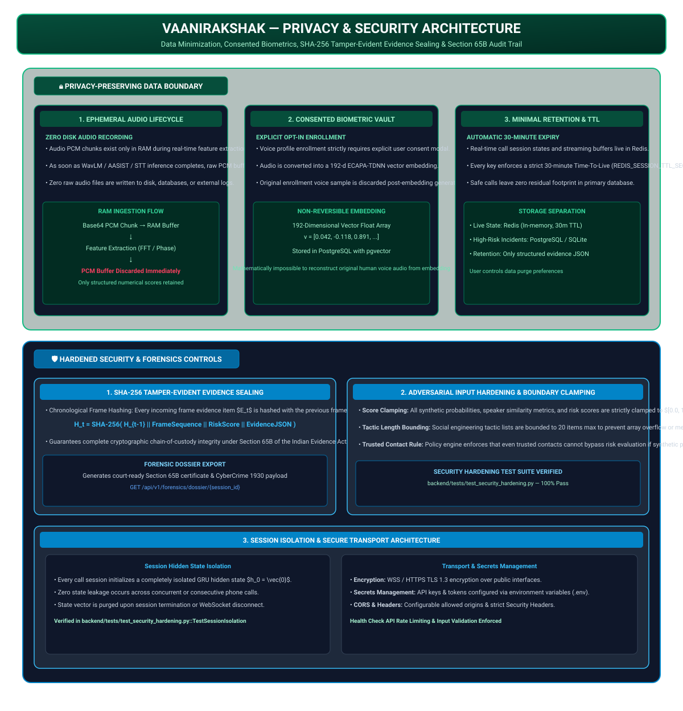

# Privacy & Security Architecture — VaaniRakshak

## 📌 Overview

**VaaniRakshak** is designed under a **Privacy-First & Zero-Trust Security Paradigm**. The architecture enforces strict data minimization, ephemeral in-memory audio lifecycle management, consented non-reversible biometric vector embeddings, cryptographic Section 65B SHA-256 evidence chain sealing, and adversarial input boundary clamping.

---

## 🏗️ Privacy & Security Architecture Diagram

---

## 🔒 Privacy-Preserving Architecture Pillars

### 1. Ephemeral Audio Processing Lifecycle (Zero Disk Audio Recording)
- Raw audio PCM chunks are received via Base64 over WebSocket and processed **ephemerally in RAM memory only**.
- Feature extraction (WavLM/AASIST spectro-temporal features, ECAPA-TDNN embeddings, faster-whisper ASR tokens) executes in memory.
- As soon as inference completes for a frame, the raw PCM buffer is **immediately purged from memory**.
- **Zero raw call audio is saved to disk, persistent databases, or external log stores.**

### 2. Consented Non-Reversible Biometric Profile Vault
- Voice biometric enrollment for trusted contact verification strictly requires explicit user opt-in consent.
- Enrolled audio is converted into a **192-dimensional numerical embedding vector** (ECAPA-TDNN).
- Original voice recordings are permanently deleted post-embedding generation.
- Vectors are stored in PostgreSQL using `pgvector`. It is **mathematically impossible** to reconstruct original human voice audio from a 192-d floating point embedding vector.

### 3. Ephemeral Redis Session State & 30-Minute Automatic TTL
- Active call states and streaming buffers reside in Redis (`redis://localhost:6379/0`).
- All Redis session keys enforce a strict **30-minute Time-To-Live (TTL)** (`REDIS_SESSION_TTL_SEC: 1800`).
- Safe or benign calls leave zero residual data footprint in the persistent primary database.

---

## 🛡️ Hardened Security & Forensic Audit Controls

### 1. Section 65B SHA-256 Tamper-Evident Evidence Sealing
Every chronological frame update $E_t$ generates a tamper-evident cryptographic hash chain:

$$H_t = \text{SHA-256}(H_{t-1} \parallel \text{Sequence} \parallel \text{RiskScore} \parallel \text{EvidenceJSON})$$

- Ensures complete chain-of-custody integrity under **Section 65B of the Indian Evidence Act**.
- Formats structured submission payloads for **National Cyber Crime Reporting Portal (1930 / I4C)**.

### 2. Adversarial Input Hardening & Domain Clamping
- All score inputs, synthetic probabilities, and risk metrics are clamped to valid numerical domains ($[0.0, 1.0]$ or $[0, 100]$) to prevent mathematical overflow or bypass attacks.
- Tactic arrays are bounded to 20 items max to prevent memory exhaustion attacks.
- **Trusted Contact Rule**: Trusted contact status cannot bypass risk evaluation if synthetic probability exceeds 0.30.

### 3. Session Isolation & Transport Encryption
- Every call session initializes a completely isolated GRU hidden state vector $h_0 = \vec{0}$, preventing state leakage across calls.
- Encrypted data transit over **WSS / HTTPS TLS 1.3**.

---

## 📁 Related Architecture Specifications

- [01 Primary Judge Architecture](01_judge_architecture.md)
- [02 AI/ML Pipeline](02_ai_ml_pipeline.md)
- [03 Runtime Sequence](03_runtime_sequence.md)
- [04 Deployment Architecture](04_deployment_architecture.md)
- [06 Attack Lab Boundary Specification](06_attack_lab_boundary.md)
