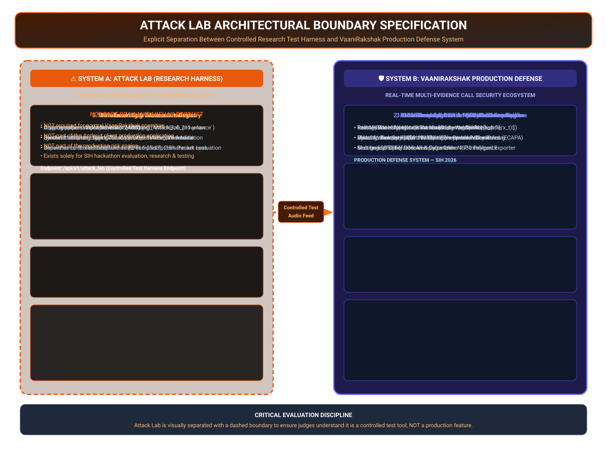

# Attack Lab Boundary Specification — VaaniRakshak

## 📌 Critical Product Boundary

> [!IMPORTANT]
> **Attack Lab is NOT part of the VaaniRakshak production product or user journey.**
> Attack Lab exists solely as a **separate controlled research, adversarial testing, and demonstration tool** used to evaluate defense engine robustness against synthetic voice clones and telecom network degradation.

---

## 🏗️ Architectural Boundary Diagram

---

## 🔍 System Differentiation Matrix

| Characteristic | System A: Attack Lab | System B: VaaniRakshak Defense Engine |
| :--- | :--- | :--- |
| **Primary Purpose** | Controlled adversarial audio generation & degradation testing | Real-time multilingual voice-call threat detection & prevention |
| **User Base** | Security researchers, AI evaluators, Hackathon judges | Citizens, Android phone users, Enterprise security teams |
| **Android App Integration** | **NONE** — Not part of the production Android application | Direct integration via `CallScreeningService` & Jetpack Compose HUD |
| **Production Risk Engine** | **NONE** — Does not compute production risk or policy decisions | Hosts GRU temporal state engine & deterministic policy rules |
| **Audio Source** | Synthetic TTS adapters (Bark, Coqui, OpenVoice) & degradation pipeline | Live incoming phone call audio streams (supported research mode / carrier tap) |
| **Deployment Boundary** | Separate test harness container (`/api/v1/attack_lab`) | Primary defense backend container (`/api/v1/session`, `/ws/call`) |
| **Operation Requirement** | **Optional** — Not required for normal VaaniRakshak defense operation | **Mandatory Core** — Primary security protection system |

---

## 🛠️ Attack Lab Technical Architecture

### 1. Modular Generator Adapter Pattern (`VoiceGenerator`)
- Implements abstract base class adapter pattern supporting multiple TTS synthesis engines:
  - `BarkXTTSAdapter`: Neural acoustic vocoder synthesis.
  - `CoquiAdapter`: Multilingual voice clone synthesis.
  - `OpenVoiceAdapter`: Instant voice cloning adapter.
  - `MockAudioAdapter`: Offline test waveform generator for deterministic test suites.

### 2. Telecom Network Degradation Pipeline (`DegradationSimulator`)
Simulates real-world cellular and VoIP impairments to test defense engine resilience:
- **Codec Compression**: AMR-WB (12.65 kbps), AMR-NB (7.4 kbps), G.711 $\mu$-law compression.
- **Bandwidth Filtering**: Narrowband ($300\text{Hz} - 3.4\text{kHz}$) and Wideband ($50\text{Hz} - 7\text{kHz}$).
- **Acoustic Noise Injection**: Street, babble, and impulse background noise at SNR $5\text{dB} - 25\text{dB}$.
- **Network Impairments**: Simulated packet loss ($2\% - 5\%$) and jitter.

### 3. Cryptographic Provenance Registry
- Assigns cryptographic provenance IDs to all generated test samples (`attack_lab_provenance`).
- Tracks ground-truth synthetic probabilities and acoustic degradation parameters for automated benchmark verification.

---

## 📁 Related Architecture Specifications

- [01 Primary Judge Architecture](01_judge_architecture.md)
- [02 AI/ML Pipeline](02_ai_ml_pipeline.md)
- [03 Runtime Sequence](03_runtime_sequence.md)
- [04 Deployment Architecture](04_deployment_architecture.md)
- [05 Privacy & Security Architecture](05_privacy_security_architecture.md)
